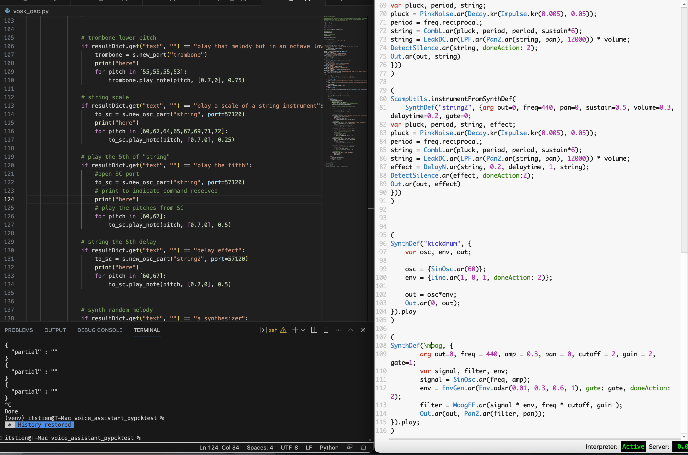

# Voice-controlled Synthesizer
A synthesizer that accepts voice commands to play sound and control the synth's parameters.
 

  *-- a capstone project by Tien Nguyen*

  

----
## About the project
This project explores a new way of making music by using voice commands. So, instead of turning the knobs or moving the faders up and down, you can issue a voice command and the computer can do it for you. This add-on feature could benefit those who have weakness in hands that won’t allow them to use the physical synth for a long time.
  

----
## Methods
Speech recognition and synthesizer are the two main topics covered in this project.
For the speech recognition sofware, I explored both Python online and offline engines. Primarily, [Google Speech Recognition](https://pypi.org/project/SpeechRecognition/) (online) and [VOSK API](https://alphacephei.com/vosk/) (offline). There's a significant delay in recognizing your voice in the Google Speech recognition engine, thus I ended up using VOSK API, which was faster and more reliable. For the synthesizer software, I used a platform called [SuperCollider](https://supercollider.github.io/), where I got all the sounds and music from by establishing OSC communication between Python and SuperCollider.

Singal flow block diagram:
  

  
Python and SC script example:
  

  

----
## Installation
To run the test script, you will need to instal VOSK API (instructions are [here](https://alphacephei.com/vosk/install)) and you need to download the US English language model as well ([models](https://alphacephei.com/vosk/models)), and then download the SuperCollider software ([here](https://supercollider.github.io/downloads)).
  
In addition to the speech recognition package, I used another Python library called SCAMP (Suite for Computer-Assisted Music in Python) to establish the OSC communication. Here are its [documentation](http://scamp.marcevanstein.com/) and [installation](https://pypi.org/project/scamp/). I also include the tutorial [link](https://www.youtube.com/watch?v=K2jZOdWegL8&ab_channel=MarcEvanstein%2Fmusic%E2%80%A4py) made by Marc Evanstein on how to get SCAMP on SuperCollider. Alternatively, you can just establish a simpler [OSC communication](https://doc.sccode.org/Guides/OSC_communication.html) and that would require you to modify the scripts.
  
Finally, you can dowload the ().py and ().sc in this repository to your computer. Make sure to open the SuperCollider file while running the Python file.
  

----

## Demonstration
video...

----
## Conclusion and further actions
This project is still at its early stage. There are various things needed to be fixed and changed for the synthesizer to achieve its stable form. Right now, its actions are quite straightforward, therefore, some other actions that I hope it can do include:

- Detect voice command during the playback
- Ability to record and save both the built-in sounds and from the input mic
- Apply audio effects on the input mic audio files as command
- Extend the audio effect library such as modulation, dynamic, and EQ
  

----
## References
Python script is based on VOSK API developers' [code](https://github.com/alphacep/vosk-api/blob/master/python/example/test_microphone.py)
 
SuperCollider script is based on SCAMP developers' [code](https://www.youtube.com/watch?v=K2jZOdWegL8&ab_channel=MarcEvanstein%2Fmusic%E2%80%A4py)
 
Block diagram, Python and SC script example by Tien Nguyen

