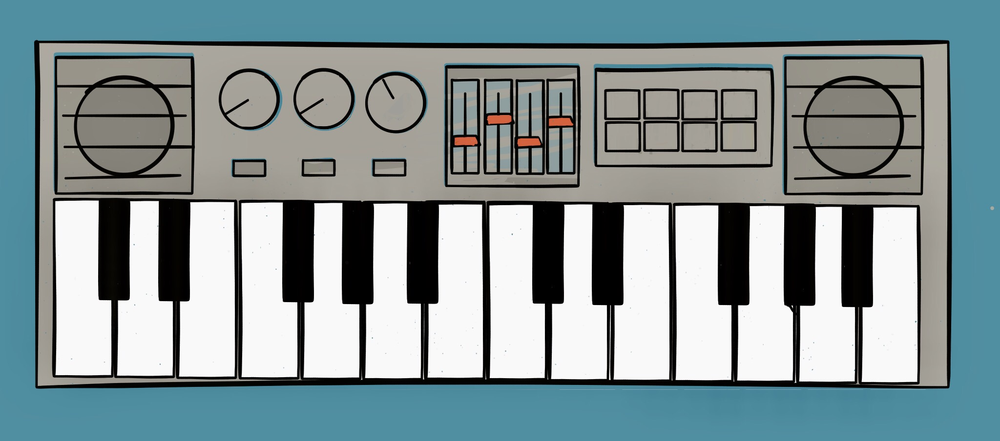
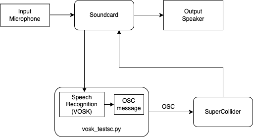

A synthesizer that accepts voice commands to play sound and control the synth's parameters.

---

## Introduction
 

  
  

 
 
This project explores a new way of making music by using voice commands. So, instead of turning the knobs or moving the faders up and down, you can issue a voice command and the computer can do it for you. This add-on feature could benefit those who have weakness in hands that won't allow them to use the physical synth for a long time.

---

## Methods
Speech recognition and synthesizer are the two main topics covered in this project.
For the speech recognition sofware, I explored both Python online and offline engines. Primarily, [Google Speech Recognition](https://pypi.org/project/SpeechRecognition/) (online) and [VOSK API](https://alphacephei.com/vosk/) (offline). There's a significant delay in recognizing your voice in the Google Speech recognition engine, thus I ended up using VOSK API, which was faster and more reliable. For the synthesizer software, I used a platform called [SuperCollider](https://supercollider.github.io/), which where I got all the sounds and music from by establishing OSC communication between Python and SuperCollider.

Singal flow block diagram:
  

---

## Concluding thoughts and further goals
As you can tell, this project is still at its early stage. There are various things needed to be fixed and changed for the synthesizer to achieve its stable form. Some further goals that I'm aiming for right now including:

- Detect voice command during the playback
- Ability to record and save both the built-in sounds and from the input mic
- Apply audio effects on the input mic audio files as command
- Extend the audio effect library such as modulation, dynamic, and EQ

---

## References
